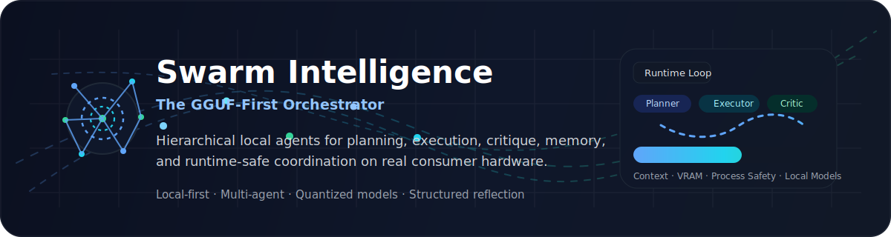
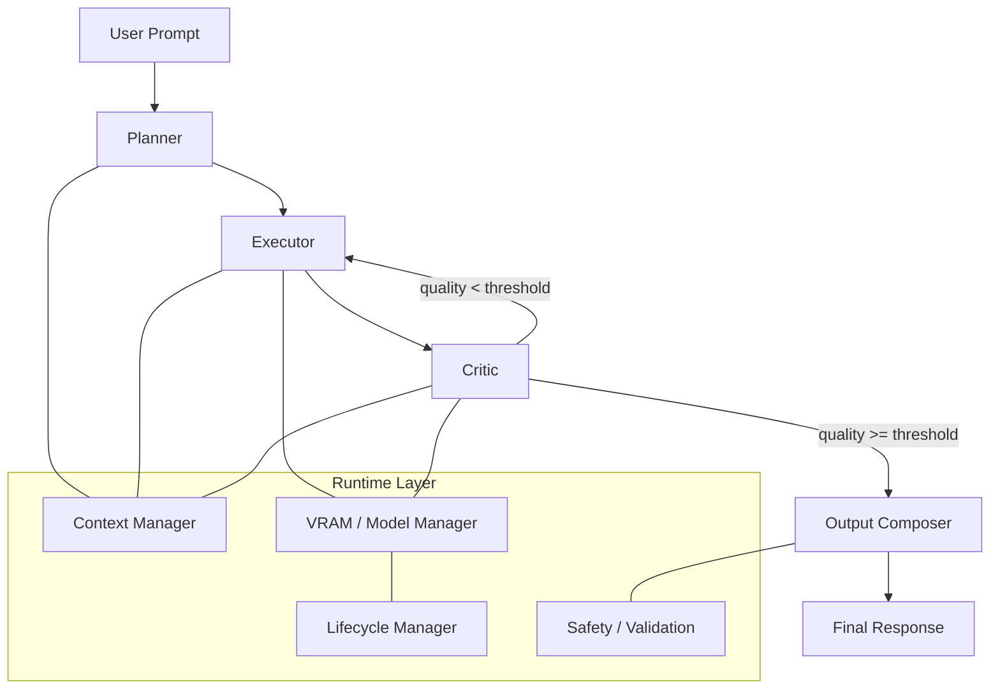

# Swarm Intelligence — GGUF-First Local Agent Orchestration

<div id="top"></div>

<p align="center">
  
</p>

<p align="center">
  <strong>Local-first multi-agent orchestration for GGUF models.</strong><br/>
  Planning, execution, critique, memory, and runtime control — designed for real consumer hardware.
</p>

<p align="center">
  
  
  
  
  
</p>

---

## Hero Banner

<p align="center">
  
</p>

---

## Why this project exists

Most local AI stacks are either:

* **single-model chat wrappers** with no real orchestration,
* **cloud-shaped abstractions** forced onto local hardware,
* or **fragile demos** that collapse under memory pressure, weak critique, or poor process control.

**Swarm Intelligence** takes a different path.

It treats local inference as a **coordinated cognitive system**:

* one agent plans,
* one agent executes,
* one agent critiques,
* and the runtime continuously manages memory, context, and model safety.

The result is a **GGUF-first orchestration layer** built for people who want serious local AI behavior on real machines.

---

## Core idea

Instead of asking one model to do everything badly, this system divides reasoning into specialized roles:

1. **Planner** decomposes the task.
2. **Executor** produces the draft.
3. **Critic** scores the result and returns structured feedback.
4. **Orchestrator** decides whether to accept, revise, retry, or stop.

This creates a loop that is more stable, more inspectable, and far easier to improve than monolithic prompting.

---

## Architecture



---

## Feature highlights

### 1. Reflection loop

The Critic does not merely comment. It returns structured feedback that the system can act on.

* quality scoring
* targeted revision instructions
* automatic regeneration below threshold
* cleaner outputs before the user sees anything

### 2. Token-aware context packing

Instead of blunt “last N messages” memory, the system manages context by estimated token density.

* respects hard model window limits
* preserves important context longer
* reduces silent degradation
* avoids context overfill on smaller GGUF models

### 3. VRAM-aware orchestration

Running multiple local models is not free. Swarm Intelligence manages that pressure deliberately.

* allocation control
* concurrency guards
* staged model usage
* layer offloading strategy
* safer behavior on limited GPUs

### 4. Process hygiene

Local inference workflows often leave behind broken server state.

* zombie llama-server cleanup
* startup sanity checks
* controlled shutdown behavior
* better recovery after interrupted runs

### 5. GGUF-first design

The project is designed around practical local model deployment rather than treating GGUF as an afterthought.

* llama.cpp compatibility mindset
* local runtime assumptions
* quantized model ergonomics
* consumer hardware realism

---

## What makes it different

| Standard local chat app       | Swarm Intelligence                      |
| ----------------------------- | --------------------------------------- |
| One model, one answer         | Multiple specialized agents             |
| Minimal validation            | Built-in critique loop                  |
| Static message memory         | Token-aware context packing             |
| Weak runtime control          | VRAM and process management             |
| UI-first demo structure       | orchestration-first architecture        |
| Difficult to inspect failures | explicit stages and structured feedback |

---

## Technical stack

| Layer         | Technology                                             |
| ------------- | ------------------------------------------------------ |
| Backend       | FastAPI + Python                                       |
| Inference     | llama.cpp / llama-server                               |
| Model Format  | GGUF                                                   |
| Database      | SQLite + SQLAlchemy                                    |
| Frontend      | Next.js 14 + Tailwind CSS                              |
| Orchestration | Custom multi-agent runtime                             |
| Runtime Focus | local-first, consumer hardware, process-safe execution |

---

## Example orchestration flow

```text
User asks a complex task
→ Planner builds strategy
→ Executor generates first draft
→ Critic scores output as JSON
→ If score is too low, feedback goes back into Executor
→ If score passes threshold, output is finalized
→ Runtime logs state and frees resources cleanly
```

---

## Installation

### Prerequisites

* Python 3.10+
* Node.js 18+
* a working `llama-server` binary
* one or more GGUF models

### Backend

```bash
cd backend
pip install -r requirements.txt
python -m uvicorn main:app --reload
```

### Frontend

```bash
cd frontend
npm install
npm run dev
```

---

## Agent configuration

```yaml
critic:
  role: "QA Lead"
  goal: "Logic, consistency, and risk validation"
  prompt_template: |
    Role: {{ role }}
    Evaluate the following output: {{ input }}
    Return strict JSON:
    {
      "quality": 1,
      "feedback": "What must be improved"
    }
```

You can define different agent personalities, thresholds, and routing rules to match your workload.

---

## Design philosophy

This project is built around a few strong assumptions:

* **local-first matters**
* **small models need better orchestration, not just bigger prompts**
* **runtime discipline is part of intelligence**
* **structured critique beats vague self-reflection**
* **consumer hardware deserves serious software design**

---

## Recommended README enhancements for your repo

To push this even further, add these files to your repository:

* `assets/hero-banner.svg` → dedicated animated banner file
* `assets/architecture-dark.svg` → clean architecture visual
* `assets/swarm-loop.svg` → planner / executor / critic loop graphic
* `docs/runtime.md` → deep explanation of VRAM, process lifecycle, context packing
* `docs/agents.md` → how agents are configured and extended
* `docs/benchmarks.md` → actual latency, memory, and quality measurements

That will make the project feel much more like a real high-end systems product.

---

## Roadmap

* multi-model routing by task type
* benchmark dashboard for latency and memory
* per-agent model assignment
* richer execution traces
* visual orchestration inspector
* hot-swappable agent templates
* stronger local safety policies

---

## License

Distributed under the MIT License. See `LICENSE` for details.

---

<p align="center">
  <strong>Build serious local intelligence.</strong><br/>
  <sub>Not a chat wrapper. A runtime for coordinated reasoning.</sub>
</p>

<p align="center">
  <a href="#top">Back to top</a>
</p>
